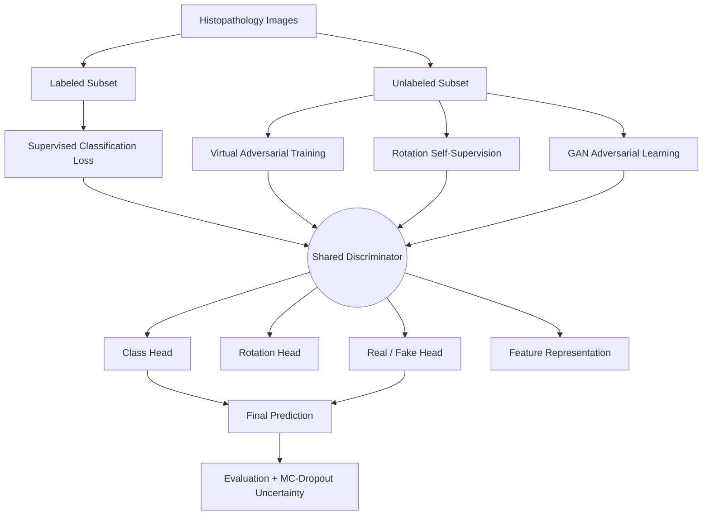
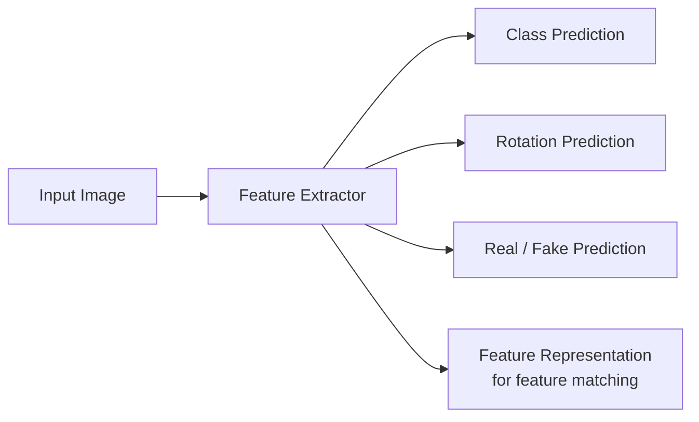

# SemiGAN-MelanoPath v2

### Semi-Supervised GAN with Consistency Regularization and Self-Supervision for Histopathology Cancer Detection Under Extreme Label Scarcity

[](https://www.python.org/)
[](https://pytorch.org/)
[]()
[]()
[]()
[]()

> **Note on the name:** "MelanoPath" is the project's codename. The dataset and task are breast-cancer **histopathology** classification (BreakHis) — not melanoma. This README describes the task accurately as histopathology cancer detection throughout.

---

## Table of Contents

- [Overview](#overview)
- [Research Question](#research-question)
- [Key Highlights](#key-highlights)
- [Methodology](#methodology)
- [Dataset & Patient-Level Splitting](#dataset--patient-level-splitting)
- [Extreme Label Scarcity](#extreme-label-scarcity)
- [Experimental Framework (E1–E5)](#experimental-framework-e1e5)
- [Results](#results)
- [Evaluation Metrics](#evaluation-metrics)
- [Project Structure](#project-structure)
- [Installation & Usage](#installation--usage)
- [Reproducibility](#reproducibility)
- [Current Status](#current-status)
- [Limitations](#limitations)
- [Future Work](#future-work)
- [Citation](#citation)
- [Author](#author)

---

## Overview

**SemiGAN-MelanoPath v2** is a research framework for **histopathology cancer classification under extreme label scarcity** — the setting where only a tiny fraction of available medical images have expert-verified labels.

The framework combines five learning signals in a single discriminator network:

| Component | Role |
|---|---|
| Supervised classification | Learns directly from the (small) labeled set |
| Semi-supervised GAN | Learns from real vs. generated samples, exploiting unlabeled data |
| Virtual Adversarial Training (VAT) | Consistency regularization — stable predictions under small input perturbations |
| Rotation self-supervision | Auxiliary label-free task (predict 0°/90°/180°/270°) that shapes useful representations |
| Feature matching + noise injection | Additional regularization on intermediate representations |
| MC-Dropout | Estimates predictive uncertainty at inference time, not just a point prediction |

## Research Question

> **Can semi-supervised adversarial learning, combined with consistency regularization and self-supervised objectives, improve histopathology cancer classification when only a very small fraction of training patients are labeled?**

Medical image annotation requires domain experts and is expensive to scale. This project tests whether the *unlabeled* majority of a histopathology dataset can still be put to productive use — rather than discarded — when labels are scarce.

## Key Highlights

- End-to-end pipeline: data loading → patient-level splitting → label-budget generation → semi-supervised training → uncertainty-aware evaluation → result aggregation
- Real experimental validation on **BreakHis** (7,909 images / 82 patients), not a toy dataset
- Strict **patient-level** train/val/test splitting to eliminate leakage — a common failure mode in medical-imaging papers
- A 5-stage **controlled ablation design** (E1 → E5) isolating the contribution of GAN learning, VAT, rotation SSL, and feature matching
- Uncertainty quantification via MC-Dropout (entropy, mutual information, probability variance) rather than reporting accuracy alone
- Transparent reporting: the repo explicitly separates **implemented**, **experimentally validated**, and **planned** work — see [Limitations](#limitations)

---

## Methodology

### Architecture



### Dual-Head Discriminator



**Virtual Adversarial Training** encourages stable predictions under a worst-case small perturbation:

$$\mathcal{L}_{VAT} = D_{KL}\big(p(y \mid x) \,\|\, p(y \mid x + r_{adv})\big)$$

**Supervised loss** on the labeled subset is standard cross-entropy:

$$\mathcal{L}_{sup} = CE(y, \hat{y})$$

**Monte Carlo Dropout** replaces a single forward pass with $N$ stochastic passes at inference, from which predictive entropy, expected entropy, mutual information, and probability variance are computed — giving an uncertainty estimate alongside every prediction rather than a bare class label.

---

## Dataset & Patient-Level Splitting

**BreakHis** (Breast Cancer Histopathological Image Classification):

| Property | Value |
|---|---:|
| Total images | 7,909 |
| Total patients | 82 |
| Benign images | 2,480 |
| Malignant images | 5,429 |

Splitting is done **at the patient level**, not the image level, so that no patient's images appear in more than one partition:


| Split | Patients | Images |
|---|---:|---:|
| Train | 56 | 5,498 |
| Validation | 13 | 1,271 |
| Test | 13 | 1,140 |
| **Total** | **82** | **7,909** |

This matters because histopathology images from the same patient are visually correlated — image-level random splitting would let the model implicitly "see" the test patient during training, inflating reported performance.

---

## Extreme Label Scarcity

The framework supports controlled labeled-data budgets: **1%, 5%, 10%, 20%, 100%**.

Because selection happens at the **patient** level (whole patients are labeled or not), the *requested* percentage and the *actual* labeled percentage of images differ. The pipeline logs both, so every run is transparent about what was actually labeled:

```text
Requested label budget:     1%
Training patients:          56
Labeled patients:            2   (3.57% of training patients)
Unlabeled patients:         54
Training images:          5498
Labeled images:             297  (5.40% of training images)
Unlabeled images:         5201
```

---

## Experimental Framework (E1–E5)

A controlled, incremental ablation isolates the contribution of each component:


| Experiment | GAN | VAT | Rotation SSL | Feature Matching | Noise Injection | Purpose |
|---|:---:|:---:|:---:|:---:|:---:|---|
| **E1** | ✗ | ✗ | ✗ | ✗ | ✗ | Supervised baseline under limited labels |
| **E2** | ✓ | ✗ | ✗ | ✗ | ✗ | Contribution of semi-supervised adversarial learning |
| **E3** | ✓ | ✓ | ✗ | ✗ | ✗ | Contribution of consistency regularization |
| **E4** | ✓ | ✓ | ✓ | ✗ | ✗ | Contribution of self-supervised representation learning |
| **E5** | ✓ | ✓ | ✓ | ✓ | ✓ | Full model |

Full planned matrix: **5 experiments × 5 label budgets × N seeds**. With one seed (42), this defines **25 experimental conditions** — the framework is built to run all of them, but *only one has been executed so far* (see below).

---

## Results

### Completed run: E5 (Full Model), 1% label budget, seed 42


| Metric | Test Result |
|---|---:|
| Accuracy | 0.5781 |
| Precision | 0.6898 |
| Recall | 0.7576 |
| F1 | 0.7221 |
| ROC-AUC | 0.4922 |

**Reading these honestly:** this is a single run at the hardest label budget (1%), with one seed. The ROC-AUC near 0.5 indicates the model's ranking of positive vs. negative cases is close to random at this extreme label budget — which is itself a useful (if modest) finding, and precisely why the multi-seed, multi-budget comparison in [Future Work](#future-work) is necessary before drawing conclusions about the method's effectiveness. This run should be read as **evidence the pipeline works end-to-end**, not as a performance claim.

---

## Evaluation Metrics

Standard classification metrics (Accuracy, Precision, Recall, F1, ROC-AUC) plus:

- **Expected Calibration Error (ECE)** — gap between model confidence and empirical accuracy
- **Uncertainty metrics** via MC-Dropout — predictive entropy, expected entropy, mutual information, probability variance, coverage-based evaluation

---

## Project Structure

```text
SemiGAN-MelanoPath/
├── configs/            # YAML experiment configuration
├── data/                # Dataset loaders (BreakHis, MHIST)
├── models/              # Architectures + loss functions
├── training/             # Training loop
├── eval/                 # Evaluator, checkpoint evaluation, metrics
├── experiments/           # Experiment matrix definitions + runner
├── scripts/               # Result aggregation
├── results/                # aggregated_results.csv
├── runs/                    # Per-run checkpoints, logs, outputs
├── tests/
├── notebooks/
├── docs/
│   └── research_problem.md
├── train.py
├── requirements.txt
└── README.md
```

---

## Installation & Usage

### Setup

```bash
git clone https://github.com/iqrasafdarr/SemiGAN-MelanoPath.git
cd SemiGAN-MelanoPath

python3.11 -m venv .venv
source .venv/bin/activate        # Windows: .venv\Scripts\Activate.ps1

pip install -r requirements.txt
```

Set your local BreakHis path in `configs/default.yaml`:

```yaml
data:
  breakhis_root: /path/to/BreaKHis_v1/histology_slides/breast
  mhist_root: ./data/MHIST
```

### Train

```bash
python train.py \
    --config configs/default.yaml \
    --exp E5_full \
    --label-pct 1 \
    --seed 42
```

### Run the experiment matrix

```bash
python experiments/run_experiment.py --validate       # sanity-check config
python experiments/run_experiment.py --dry-run          # simulate without training
python experiments/run_experiment.py --run --experiment E5_full --label-pct 1 --seed 42
```

### Aggregate results

```bash
python scripts/aggregate_results.py     # → results/aggregated_results.csv
```

### Evaluate a checkpoint

```bash
python eval/evaluate_checkpoint.py \
    --ckpt runs/E5_full_lbl1_s42/checkpoints/best.pt \
    --dataset breakhis \
    --device cpu \
    --config configs/default.yaml
```

---

## Reproducibility

Every run is identified by a canonical name `<experiment>_lbl<label_pct>_s<seed>` (e.g. `E5_full_lbl1_s42`) and produces:

- Fixed-seed training with a versioned YAML config
- Explicit requested vs. actual label percentages (patient- and image-level)
- Saved checkpoints, training logs, and JSON result files
- A single aggregated CSV across all completed runs

---

## Current Status

```text
Implementation                                      COMPLETE
  Patient-level splitting, label budgets, E1–E5,
  VAT, rotation SSL, feature matching, noise
  injection, MC-Dropout, evaluation, experiment
  runner, result aggregation

Experimentally validated
  E5, 1% label budget, BreakHis, seed 42            ✅ DONE

Not yet completed
  Full 25-condition matrix (5 exp × 5 budgets)      ⬜
  Multi-seed variance study                          ⬜
  External MHIST validation (real data)              ⬜
```

---

## Limitations

1. **Only one of 25 planned conditions has been run.** E1–E4 and higher label budgets are implemented but not yet executed.
2. **Single seed (42).** No variance estimate yet across seeds.
3. **MHIST loader exists but is untested on real data** — external cross-domain validation is pending.
4. **Compute-bound.** Running the full matrix with multiple seeds is the main bottleneck to completing the study.
5. **Current results are not evidence of superiority** over simpler baselines — they demonstrate the pipeline runs correctly end-to-end at the hardest label budget.

## Future Work

- Run the full E1–E5 × label-budget matrix
- Multi-seed evaluation for variance estimates
- Real MHIST external validation
- Statistical significance testing between ablation stages
- Calibration analysis across label budgets
- Uncertainty-vs-correctness and abstention curves
- Cross-domain generalization study
- Hyperparameter sensitivity analysis
- Formal write-up as a research manuscript

---

## Citation

```bibtex
@software{semiGAN_melanopath_v2,
  author = {Safdar, Iqra},
  title  = {SemiGAN-MelanoPath v2: Semi-Supervised GAN with Consistency
            Regularization and Self-Supervision for Histopathology Cancer
            Detection Under Extreme Label Scarcity},
  year   = {2026},
  url    = {https://github.com/iqrasafdarr/SemiGAN-MelanoPath}
}
```

## Author

**Iqra Safdar**
BS Computer Science, COMSATS University Islamabad, Sahiwal Campus
GitHub: [github.com/iqrasafdarr](https://github.com/iqrasafdarr) · Repo: [SemiGAN-MelanoPath](https://github.com/iqrasafdarr/SemiGAN-MelanoPath)
