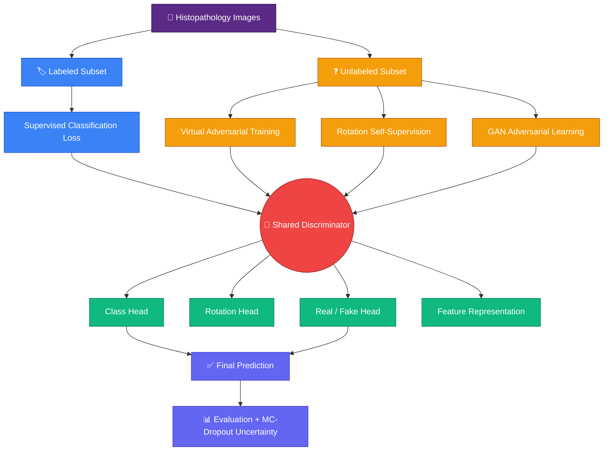
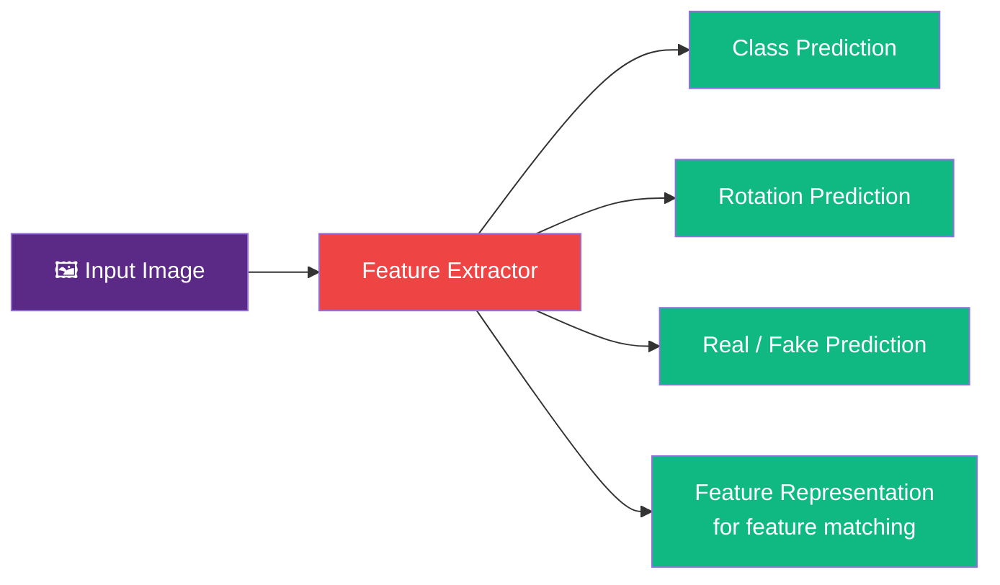
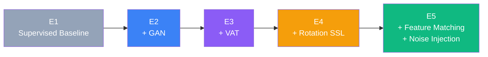

<p align="center">
  
</p>

<p align="center">
  
  
  
  
  
  
  
</p>

<p align="center"><i>A research-grade pipeline investigating whether semi-supervised GANs, consistency regularization, and self-supervision can make histopathology cancer classification work with almost no labeled data.</i></p>

> 🔎 **Naming note:** "MelanoPath" is this project's codename — the dataset and task are **breast-cancer histopathology** classification on **BreakHis**, not melanoma. Every section below describes the task accurately as histopathology cancer detection.

---

## 📑 Table of Contents

1. [Overview](#-overview)
2. [Research Problem & Question](#-research-problem--question)
3. [Research Objectives](#-research-objectives)
4. [Main Contributions](#-main-contributions)
5. [Methodology](#-methodology)
6. [Dataset](#-dataset)
7. [Patient-Level Data Splitting](#-patient-level-data-splitting)
8. [Extreme Label Scarcity](#-extreme-label-scarcity)
9. [Experimental Framework (E1–E5)](#-experimental-framework-e1e5)
10. [Experiment Matrix](#-experiment-matrix)
11. [Current Experimental Status](#-current-experimental-status)
12. [Results](#-results)
13. [Evaluation Metrics](#-evaluation-metrics)
14. [Project Structure](#-project-structure)
15. [Installation](#-installation)
16. [Usage](#-usage)
17. [Reproducibility](#-reproducibility)
18. [Research Design Philosophy](#-research-design-philosophy)
19. [Limitations](#-limitations)
20. [Future Work](#-future-work)
21. [Research Integrity](#-research-integrity)
22. [Current Status](#-current-status)
23. [Citation](#-citation)
24. [Author](#-author)

---

## 🧬 Overview

**SemiGAN-MelanoPath v2** is a research-oriented semi-supervised deep learning framework built for **histopathology cancer detection when only a very small fraction of the training data is labeled**.

It investigates whether the *unlabeled majority* of a histopathology dataset can be turned into a useful learning signal, instead of being thrown away, through a combination of:

- 🧪 Semi-supervised Generative Adversarial Learning
- 🎯 Virtual Adversarial Training (VAT) for consistency regularization
- 🔄 Rotation-based self-supervised learning
- 🪞 Feature matching
- 🌫️ Gaussian noise injection
- 🧠 A dual-head discriminator (classification + real/fake)
- 🎲 Monte Carlo Dropout uncertainty estimation
- 🧍 Patient-level dataset splitting (zero leakage)
- 🧫 Controlled, incremental ablation experiments (E1 → E5)

Rather than assuming every image has a label, the framework explicitly splits training data into a **small labeled subset** and a **much larger unlabeled subset**, and combines supervised classification with additional learning signals pulled from the unlabeled images.

---

## 🧩 Research Problem & Question

Deep learning for medical image classification usually assumes large amounts of labeled data. Histopathology breaks that assumption:

> **Expert annotation is expensive, slow, and requires domain-specific pathology knowledge.**

That creates a mismatch: hospitals and research labs often have *many* images but only a *few* can realistically be annotated. Semi-supervised learning is one candidate answer — learn from labeled *and* unlabeled examples together.

This project's research question:

> **Can semi-supervised adversarial learning, combined with consistency regularization and self-supervised objectives, improve histopathology cancer classification when only a very small fraction of training patients are labeled?**

---

## 🎯 Research Objectives

| # | Objective | What it means here |
|---|---|---|
| 1 | **Extreme label scarcity** | Evaluate under controlled labeled-data budgets: 1%, 5%, 10%, 20%, 100% |
| 2 | **Patient-level evaluation** | No patient's images appear in more than one of train/val/test |
| 3 | **Semi-supervised learning** | Use labeled *and* unlabeled images together, not just the labeled slice |
| 4 | **Consistency regularization** | VAT — stable predictions under small adversarial perturbations |
| 5 | **Self-supervised learning** | Rotation prediction as a label-free auxiliary task |
| 6 | **Adversarial learning** | GAN objective where the discriminator does both classification and real/fake discrimination |
| 7 | **Uncertainty estimation** | MC-Dropout to quantify how confident the model actually is |

---

## 🏆 Main Contributions

The current implementation is a **complete, working research pipeline**, not just a model file. It contains:

- Patient-level BreakHis data processing
- Reproducible train/validation/test splitting
- Controlled label-budget generation (with requested-vs-actual tracking)
- Semi-supervised + GAN-based training loop
- Virtual Adversarial Training
- Rotation self-supervision
- Feature matching
- Noise injection
- Dual-head discriminator architecture
- MC-Dropout uncertainty estimation
- Full classification metric suite + ROC-AUC + Expected Calibration Error (ECE)
- Best-checkpoint selection
- YAML-driven experiment configuration
- Automated experiment execution (`run_experiment.py`)
- Results aggregation into a single canonical CSV
- End-to-end reproducibility controls (seeds, canonical run naming, logs)

---

## 🏗️ Methodology

### Overall Architecture



### Dual-Head Discriminator



### Semi-Supervised Learning

Let $D_L = \{(x_i,y_i)\}$ be the labeled set and $D_U = \{x_j\}$ the unlabeled set. The classifier minimizes standard cross-entropy on the labeled subset:

$$\mathcal{L}_{sup} = CE(y, \hat{y})$$

The unlabeled subset drives three additional objectives, described below.

### Virtual Adversarial Training (Consistency Regularization)

VAT pushes the model toward giving the *same* prediction for a clean image and a small, worst-case adversarially perturbed version of it:

$$\mathcal{L}_{VAT} = D_{KL}\big(p(y \mid x) \,\|\, p(y \mid x + r_{adv})\big)$$

Configurable parameters: perturbation magnitude and VAT loss weight.

### Rotation Self-Supervision

Every image can be rotated by **0° / 90° / 180° / 270°**, and the model must predict which rotation was applied. This is a completely label-free task that still forces the network to learn meaningful visual structure — useful for both labeled and unlabeled images.

### Feature Matching

Instead of relying only on the final real/fake decision, feature matching compares **intermediate feature representations** between real and generated samples, encouraging them to occupy a more similar representation space. Enabled in the full E5 configuration.

### Noise Injection

Controlled Gaussian noise is injected during training as an additional regularizer to reduce overfitting and improve robustness. Noise level is configurable.

### Monte Carlo Dropout (Uncertainty Estimation)

At inference, dropout stays active and the model runs $N$ stochastic forward passes instead of one. Aggregating those passes gives:

- Mean predictive probability
- Predictive entropy · Expected entropy · Mutual information
- Probability variance
- An overall model-uncertainty score

This produces an **uncertainty-aware** evaluation, not just a bare accuracy number.

---

## 🧫 Dataset

**BreakHis** — Breast Cancer Histopathological Image Classification dataset.

| Property | Value |
|---|---:|
| Total images | 7,909 |
| Total patients | 82 |
| Benign images | 2,480 |
| Malignant images | 5,429 |

---

## 🧍 Patient-Level Data Splitting

<p align="center">
  
</p>

| Split | Patients | Images |
|---|---:|---:|
| Training | 56 | 5,498 |
| Validation | 13 | 1,271 |
| Test | 13 | 1,140 |
| **Total** | **82** | **7,909** |

**Why this matters:** histopathology images from the same patient are visually correlated. If individual images are randomly split across train/test, the model can indirectly "see" a test patient's tissue characteristics during training — producing overly optimistic, misleading results. This implementation verifies **zero patient-ID overlap** between partitions.

---

## 🏷️ Extreme Label Scarcity

The framework supports controlled labeled-data budgets:

| Requested Budget | Purpose |
|---:|---|
| 1% | Extreme scarcity |
| 5% | Very low supervision |
| 10% | Low supervision |
| 20% | Moderate supervision |
| 100% | Fully supervised reference |

Because labeling happens at the **patient** level (whole patients, not individual images), the requested percentage and the *actual* labeled percentage of images differ. Every run logs both, so the setup stays transparent:

```text
Requested label budget:     1%
Training patients:          56
Labeled patients:            2   (3.57% of training patients)
Unlabeled patients:         54
Training images:          5498
Labeled images:             297  (5.40% of training images)
Unlabeled images:         5201
```

---

## 🧪 Experimental Framework (E1–E5)

An incremental ablation ladder isolates the contribution of every component:



<p align="center">
  
</p>

| Experiment | GAN | VAT | Rotation SSL | Feature Matching | Noise Injection | Purpose |
|---|:---:|:---:|:---:|:---:|:---:|---|
| **E1** — Baseline | ✗ | ✗ | ✗ | ✗ | ✗ | Supervised baseline under limited labels |
| **E2** — SemiGAN | ✓ | ✗ | ✗ | ✗ | ✗ | Contribution of semi-supervised adversarial learning |
| **E3** — +VAT | ✓ | ✓ | ✗ | ✗ | ✗ | Contribution of consistency regularization |
| **E4** — +Rotation SSL | ✓ | ✓ | ✓ | ✗ | ✗ | Contribution of self-supervised representation learning |
| **E5** — Full Model | ✓ | ✓ | ✓ | ✓ | ✓ | Full configuration |

---

## 🔢 Experiment Matrix

```text
5 Experiments × 5 Label Budgets × Configurable Seeds
```

Current configuration → **Experiments:** E1–E5 · **Label budgets:** 1/5/10/20/100% · **Seed:** 42

$$5 \times 5 \times 1 = 25 \text{ experimental conditions}$$

> ⚠️ **Important:** defining the 25-condition matrix does *not* mean all 25 have been run. The framework is *built* to execute them reproducibly — actual completed runs are tracked separately below.

---

## ✅ Current Experimental Status

**Completed:** E5 (Full Model) · **Label budget requested:** 1% · **Seed:** 42

```text
Training patients:        56
Labeled patients:          2      (3.57%)
Unlabeled patients:       54
Training images:        5498
Labeled images:           297     (5.40%)
Unlabeled images:        5201
```

Trained for 100 epochs with best-checkpoint selection based on validation performance. Checkpoint and experiment artifacts are stored under the corresponding `runs/` directory.

<p align="center">
  
</p>

---

## 📊 Results

### Completed run: E5, 1% label budget, seed 42 — BreakHis test set

<p align="center">
  
</p>

| Metric | Test Result |
|---|---:|
| Accuracy | 0.5781 |
| Precision | 0.6898 |
| Recall | 0.7576 |
| F1 | 0.7221 |
| ROC-AUC | 0.4922 |

**Reading this honestly:** this is one run, one seed, at the *hardest* label budget. ROC-AUC near 0.5 means the model's ranking of malignant vs. benign is close to chance at 1% labels — a real and useful finding in itself, not a flaw to hide. It's exactly why the multi-seed, multi-budget comparison in [Future Work](#-future-work) matters before making any performance claim. Treat this result as **evidence the full pipeline runs correctly end-to-end**, not as proof the method works well yet.

---

## 📐 Evaluation Metrics

$$Accuracy = \frac{TP+TN}{TP+TN+FP+FN} \qquad Precision = \frac{TP}{TP+FP} \qquad Recall = \frac{TP}{TP+FN}$$

$$F1 = 2\cdot\frac{Precision \cdot Recall}{Precision + Recall}$$

- **ROC-AUC** — binary ROC-AUC using the positive-class probability
- **Expected Calibration Error (ECE)** — gap between confidence and empirical accuracy
- **Uncertainty metrics** (via MC-Dropout) — predictive entropy, expected entropy, mutual information, probability variance, coverage-based evaluation

---

## 📁 Project Structure

```text
SemiGAN-MelanoPath/
├── configs/
│   └── default.yaml
├── data/
│   └── loaders.py
├── models/
│   ├── architectures.py
│   └── losses.py
├── training/
├── eval/
│   ├── evaluator.py
│   ├── evaluate_checkpoint.py
│   └── metrics.py
├── experiments/
│   ├── experiment_configs.yaml
│   └── run_experiment.py
├── scripts/
│   └── aggregate_results.py
├── results/
│   └── aggregated_results.csv
├── runs/
│   └── <experiment runs>
├── tests/
├── notebooks/
├── docs/
│   └── research_problem.md
├── train.py
├── requirements.txt
└── README.md
```

---

## ⚙️ Installation

**Requirements:** Python 3.11 · PyTorch 2.x · TorchVision · scikit-learn · pandas · PyYAML · matplotlib · seaborn · Pillow

```bash
git clone https://github.com/iqrasafdarr/SemiGAN-MelanoPath.git
cd SemiGAN-MelanoPath
```

**Virtual environment**

```bash
# Windows
py -3.11 -m venv .venv
.\.venv\Scripts\Activate.ps1

# Linux / macOS
python3.11 -m venv .venv
source .venv/bin/activate
```

```bash
pip install -r requirements.txt
```

**Dataset configuration** — set your local paths in `configs/default.yaml`:

```yaml
data:
  breakhis_root: D:\path\to\BreaKHis_v1\histology_slides\breast
  mhist_root: ./data/MHIST
```

The MHIST loader is included for external validation, but real MHIST data must be downloaded and configured separately before that validation can run.

---

## ▶️ Usage

**Train a single configuration**

```powershell
py -3.11 train.py `
    --config .\configs\default.yaml `
    --exp E5_full `
    --label-pct 1 `
    --seed 42 `
    --experiment E5_full
```

**Run the automated experiment matrix**

```powershell
py -3.11 .\experiments\run_experiment.py --validate      # sanity-check config
py -3.11 .\experiments\run_experiment.py --dry-run          # simulate, no training
py -3.11 .\experiments\run_experiment.py `
    --run --experiment E5_full --label-pct 1 --seed 42
```

**Aggregate results**

```powershell
py -3.11 .\scripts\aggregate_results.py
```

produces `results/aggregated_results.csv` with: experiment, label budget, seed, accuracy, precision, recall, F1, ROC-AUC, actual labeled patient %, actual labeled image %, best epoch.

**Evaluate a checkpoint** (supports MC-Dropout with multiple stochastic passes)

```powershell
py -3.11 .\eval\evaluate_checkpoint.py `
    --ckpt .\runs\E5_full_lbl1_s42\checkpoints\best.pt `
    --dataset breakhis `
    --device cpu `
    --config .\configs\default.yaml
```

---

## 🔁 Reproducibility

Built in from the start:

- Fixed random seeds
- YAML-based experiment configuration
- Explicit requested vs. actual label percentages (patient- and image-level)
- Patient-level splitting with verified zero overlap
- Canonical run identifiers: `<experiment>_lbl<label_pct>_s<seed>` → e.g. `E5_full_lbl1_s42`
- Saved checkpoints, training logs, JSON result files
- Automated aggregation into one canonical CSV

---

## 🧠 Research Design Philosophy

**Why an incremental ablation (E1 → E5)?** Adding one component at a time isolates *which* piece of the method is actually responsible for any change in performance — rather than reporting one black-box "full model" number and hoping it's the GAN, the VAT, or the SSL doing the work.

**Why patient-level splitting?** Random image-level splitting can leak patient-specific visual characteristics into training, silently inflating test performance. Splitting at the patient level with a verified zero-overlap check removes that failure mode entirely.

**Why extreme label scarcity?** Medical annotation needs specialists and doesn't scale. If a dataset has thousands of images but only a handful can realistically be labeled, a method that still needs a label per image is impractical. The 1% condition is deliberately the hardest setting in the design — few labeled images, many unlabeled images, and the question of whether that unlabeled majority can still be turned into better representations.

---

## ⚠️ Limitations

1. **Only 1 of 25 planned conditions has been run.** E1–E4 and the higher label budgets (5/10/20/100%) are implemented but not yet executed.
2. **Single seed (42).** No variance estimate across seeds yet.
3. **MHIST loader exists but is untested on real data** — external cross-domain validation is pending.
4. **Compute-bound.** Running the full matrix with multiple seeds is the main remaining bottleneck.
5. **Current results are not evidence of superiority** over simpler baselines — they demonstrate the pipeline runs correctly end-to-end at the hardest label budget, nothing stronger yet.

---

## 🚀 Future Work

- [ ] Run the full E1–E5 × label-budget matrix
- [ ] Multi-seed evaluation for variance estimates
- [ ] Real MHIST external validation
- [ ] Compare against additional semi-supervised baselines
- [ ] Statistical significance testing between ablation stages
- [ ] Calibration analysis across label budgets
- [ ] Uncertainty-vs-correctness and abstention curves
- [ ] Cross-domain generalization study
- [ ] Hyperparameter sensitivity analysis
- [ ] Stronger augmentation strategies
- [ ] Alternative backbone architectures
- [ ] Detailed error analysis
- [ ] Formal write-up as a research manuscript

---

## 🔍 Research Integrity

This repository is explicit about three different levels of claim, and never blurs them:

| Level | Meaning |
|---|---|
| **Implemented** | Exists and runs in the codebase |
| **Experimentally validated** | Actually executed on real data with logged results |
| **Planned** | Defined by the framework, not yet executed |

The project does **not** claim every planned experiment has already been completed — see [Current Status](#-current-status) for the exact breakdown.

---

## 📌 Current Status

```text
Repository implementation        ████████████████████ COMPLETE
BreakHis integration              ████████████████████ COMPLETE
Patient-level splitting           ████████████████████ COMPLETE
Label-budget framework            ████████████████████ COMPLETE
E1–E5 experiment framework        ████████████████████ COMPLETE
VAT implementation                ████████████████████ COMPLETE
Rotation SSL                      ████████████████████ COMPLETE
Feature matching                  ████████████████████ COMPLETE
Noise injection                   ████████████████████ COMPLETE
MC-Dropout framework              ████████████████████ COMPLETE
Evaluation framework              ████████████████████ COMPLETE
Experiment runner                 ████████████████████ COMPLETE
Result aggregation                ████████████████████ COMPLETE

E5 · 1% · BreakHis validation      ████████████████████ COMPLETED
Full 25-condition study            █░░░░░░░░░░░░░░░░░░░ 1 / 25
Multi-seed study                   ░░░░░░░░░░░░░░░░░░░░ NOT STARTED
MHIST external validation          ░░░░░░░░░░░░░░░░░░░░ NOT STARTED
```

**Research outputs already produced by this infrastructure:** model checkpoints, training logs, experiment configs, JSON experiment results, aggregated CSV results, classification metrics, calibration metrics, uncertainty estimates — a reproducible foundation ready for the remaining 24 experimental conditions.

---

## 📖 Citation

```bibtex
@software{semiGAN_melanopath_v2,
  author = {Safdar, Iqra},
  title  = {SemiGAN-MelanoPath v2: Semi-Supervised GAN with Consistency
            Regularization and Self-Supervision for Histopathology Cancer
            Detection Under Extreme Label Scarcity},
  year   = {2026},
  url    = {https://github.com/iqrasafdarr/SemiGAN-MelanoPath}
}
```

---

## 👩‍💻 Author

**Iqra Safdar**
BS Computer Science · COMSATS University Islamabad, Sahiwal Campus

[](https://github.com/iqrasafdarr)
[](https://github.com/iqrasafdarr/SemiGAN-MelanoPath)

*Developed as an independent research-oriented implementation exploring semi-supervised learning, generative adversarial learning, self-supervised representation learning, and uncertainty estimation for medical image classification.*

<p align="center">
  <sub>Patient-Level Splitting + Extreme Label Budgets + Semi-Supervised GAN + VAT + Rotation SSL + Feature Matching + Noise Injection + MC-Dropout Uncertainty → <b>Reproducible Research Pipeline</b></sub>
</p>
